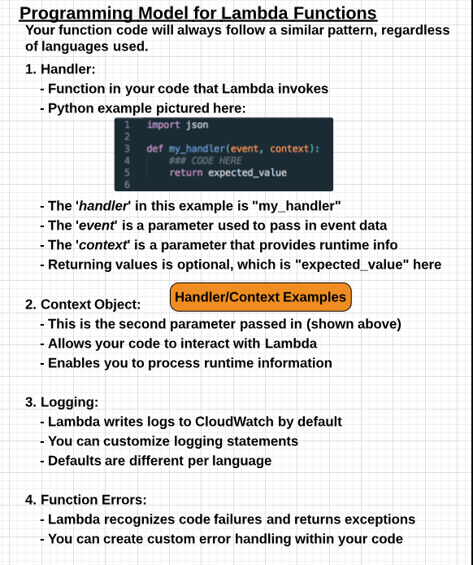
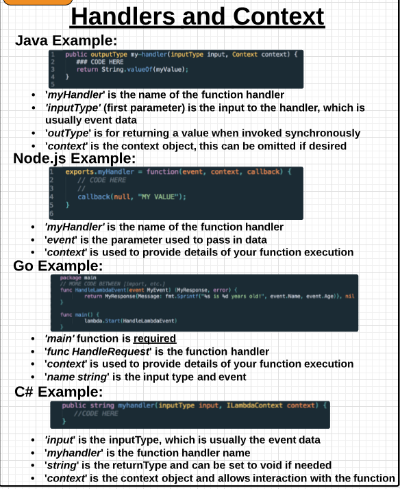
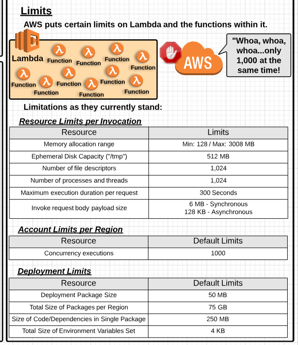
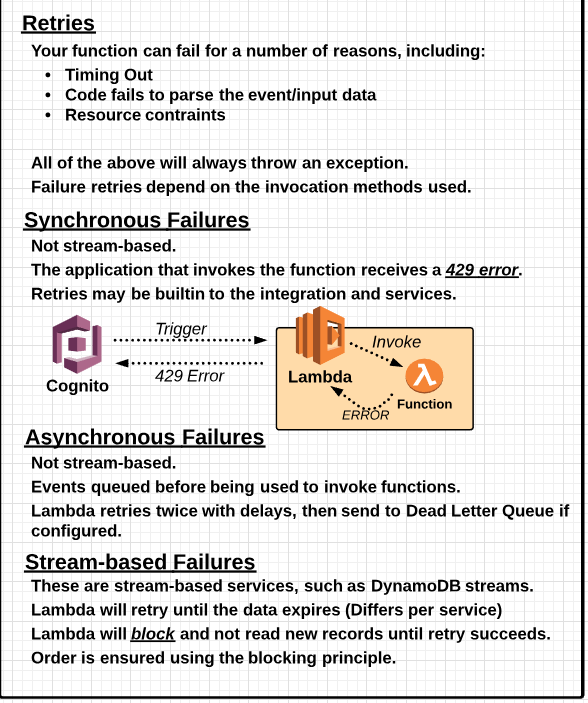

- [Introduction](#introduction)
- [Core Essentials](#core-essentials)
    - [Console](#console)
    - [Cloud Watch](#cloud-watch)
    - [CLI](#cli)
    - [Code Deployments with Lambda](#code-deployments-with-lambda)
- [Use Cases](#use-cases)
    - [Lambda to perform security tasks](#lambda-to-perform-security-tasks)
    - [Canary Code Deployments](#canary-code-deployments)
    - [Automate ECS Container Deployment](#automate-ecs-container-deployment)
- [Conclusions](#conclusions)

# Introduction

* Lambda utilizes event-driven architecture, that is it processes code on some event and it triggers some other event
* Functions are actually being computed on AWS EC2 instances but we don't have access to them
* Workloads and functions are stateless, so no data will be stored
* Since it is stateless, it can scale easily
* We are responsible for
    * Code
    * Memory Allocation 128 MB - 3008  MB
    * Exeuction Timeout 1 - 300 seconds
* AWS is responsible for 
    * Highly Available and Fault Tolerant
    * Compute and OS maintainance
    * Allocation of CPU Power (Propotion to Memory 2048 MB has 16 times that of 128 MB)
    * Networking Bandwith
    * Disk i/0
    * Code Monitoring and Logging
* Lambda Building Blocks
    * Lambda Function: The actual Code
    * Event Source: A trigger for invoking your function
    * Downstream Resource: Some service that your Lambda function calls
    * Log Streams: Cloud watch does this automatically, customizable.
    * AWS SAM: AWS Serverless architecture Model
* Tools
    * Lambda Console
    * AWS CLI
    * SAM Local (beta)

# Core Essentials

## Console
## Cloud Watch
## CLI
## Code Deployments with Lambda

# Use Cases

## Lambda to perform security tasks
## Canary Code Deployments
## Automate ECS Container Deployment

# Conclusions